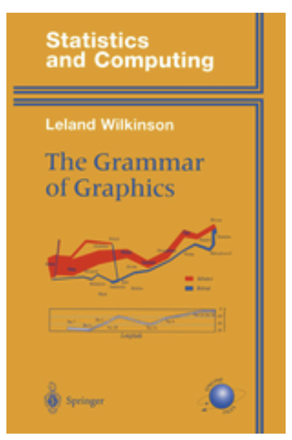
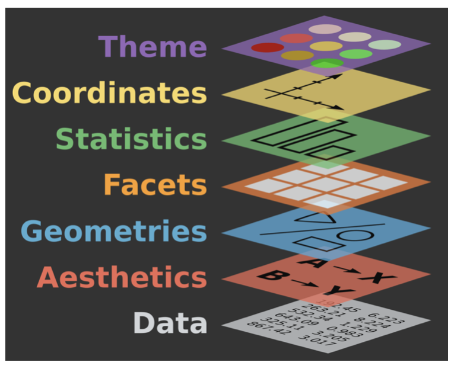

```{r child = "setup.Rmd"}
```

```{r packages, echo=FALSE, message=FALSE, warning=FALSE}
library(tidyverse)
library(palmerpenguins)
```

class: middle

# Grammar of graphics

---

## Data visualization

> *"The simple graph has brought more information to the data analyst's mind than any other device." --- John Tukey*

- Data visualization is the creation and study of the visual representation of data
- Many tools for visualizing data -- R is one of them
- Many approaches/systems within R for making data visualizations -- **ggplot2** is one of them, and that's what we're going to use

---

## What is grammar of graphics?

.pull-left[
- Describes the fundamental features that underlie all statistical graphics
- Crated by Leland Wilkinson
]
.pull-right[
```{r echo=FALSE, out.width="60%"}

```
]

---

## High level overview

.pull-left[
- Graphic **map**s the **data** to the **aes**thetic attributes (colour, shape, size) of **geom**etric shapes (points, lines, bars)
- Plot may also include **stat**istical transformations of the data,  information about the **coord**inate system, and the **theme**
- **Facet**ting can be used to plot for different subsets of the data
- Combination of these independent components make up a graphic
]
.pull-right[
```{r echo=FALSE, out.width="100%"}

```
]

.footnote[
.small[
Sources: [ggplot2: Elegant Graphics for Data Analysis](https://ggplot2-book.org/introduction.html) and [BloggoType](http://bloggotype.blogspot.com/2016/08/holiday-notes2-grammar-of-graphics.html)
]
]

---

## Composition of a plot

All plots are composed of

- the **data**: the information you want to visualise
- a **mapping**: the description of how the data’s variables are mapped to aesthetic attributes

---

## Mapping 

- **layer**: Collection of **geom**etric elements (what you actually see in the plot: points, lines, polygons, etc.) and statistical transformations (**stats**) (e.g. binning and counting observations to create a histogram, or fitting a linear model)

--

- **scales**: Mapping of values in the data space to values in the aesthetic space (e.g. use of colour, shape, size) as well as the inverse mapping (e.g. legends, axes, etc. to make it possible to read the original data values from the plot)

--

- **coord**inate system: Mapping of data coordinates to the plane of the graphic and provides axes and gridlines to help read the graph (e.g. Cartesian, polar, map projections, etc.)

--

- **facet**: Specifies how to break up and display subsets of data as small multiples

--

- **theme**: Controls the finer points of display (e.g. font size, background color) and is customizable

---

class: middle

# ggplot2

---

## Mass vs. height

```{r mass-height, out.width = "50%"}
ggplot(data = starwars, mapping = aes(x = height, y = mass)) +
  geom_point() +
  labs(title = "Mass vs. height of Starwars characters",
       x = "Height (cm)", y = "Weight (kg)")
```

---

.question[ 
- What are the functions doing the plotting?
- What is the dataset being plotted?
- Which variables map to which features (aesthetics) of the plot?
- What does the warning mean?<sup>+</sup>
]

```{r ref.label="mass-height", fig.show = "hide"}
```

.footnote[
<sup>+</sup>Suppressing warning to subsequent slides to save space
]

---

## ggplot2 $\in$ tidyverse

.pull-left[
- `gg` in "ggplot2" stands for Grammar of Graphics 
- It's built based on the **grammar of graphics**
- **ggplot2** is tidyverse's data visualization package

```{r eval=FALSE}
library(tidyverse)

# or
library(ggplot2)
```
] 
.pull-right[ 
```{r echo=FALSE, out.width="80%"}
knitr::include_graphics("img/ggplot2-part-of-tidyverse.png")
```
]

---

## Hello ggplot2!

- `ggplot()` is the main function in ggplot2
- Plots are constructed in layers
- Structure of the code for plots can be summarized as

```{r eval = FALSE}
ggplot(data = [dataset], 
       mapping = aes(x = [x-variable], y = [y-variable])) +
   geom_xxx() +
   other options
```

---

class: middle

# ggplot2 `r emo::ji("heart")` `r emo::ji("penguin")`

---

## Data: Palmer Penguins

Measurements for penguin species, island in Palmer Archipelago, size (flipper length, body mass, bill dimensions), and sex.

.pull-left-narrow[
```{r echo=FALSE, out.width="80%"}
knitr::include_graphics("img/penguins.png")
```
]
.pull-right-wide[
```{r}
library(palmerpenguins)
glimpse(penguins)
```
]

---

.panelset[
.panel[.panel-name[Plot]
```{r ref.label = "penguins", echo = FALSE, warning = FALSE, out.width = "70%", fig.width = 8}
```
]
.panel[.panel-name[Code]
```{r penguins, fig.show = "hide"}
ggplot(data = penguins, 
       mapping = aes(x = bill_depth_mm, y = bill_length_mm,
                     colour = species)) +
  geom_point() +
  labs(title = "Bill depth and length",
       subtitle = "Dimensions for Adelie, Chinstrap, and Gentoo Penguins",
       x = "Bill depth (mm)", y = "Bill length (mm)",
       colour = "Species")
```
]
]

---

class: middle

# Coding out loud

---

.midi[
> **Start with the `penguins` data frame**
]

.pull-left[
```{r penguins-0, fig.show = "hide", warning = FALSE}
ggplot(data = penguins) #<<
```
]
.pull-right[
```{r ref.label = "penguins-0", echo = FALSE, warning = FALSE, out.width = "100%", fig.width = 8}
```
]

---

.midi[
> Start with the `penguins` data frame,
> **map bill depth to the x-axis**
]

.pull-left[
```{r penguins-1, fig.show = "hide", warning = FALSE}
ggplot(data = penguins,
       mapping = aes(x = bill_depth_mm)) #<<
```
]
.pull-right[
```{r ref.label = "penguins-1", echo = FALSE, warning = FALSE, out.width = "100%", fig.width = 8}
```
]

---

.midi[
> Start with the `penguins` data frame,
> map bill depth to the x-axis
> **and map bill length to the y-axis.**
]

.pull-left[
```{r penguins-2, fig.show = "hide", warning = FALSE}
ggplot(data = penguins,
       mapping = aes(x = bill_depth_mm,
                     y = bill_length_mm)) #<<
```
]
.pull-right[
```{r ref.label = "penguins-2", echo = FALSE, warning = FALSE, out.width = "100%", fig.width = 8}
```
]

---

.midi[
> Start with the `penguins` data frame,
> map bill depth to the x-axis
> and map bill length to the y-axis. 
> **Represent each observation with a point**
]

.pull-left[
```{r penguins-3, fig.show = "hide", warning = FALSE}
ggplot(data = penguins,
       mapping = aes(x = bill_depth_mm,
                     y = bill_length_mm)) + 
  geom_point() #<<
```
]
.pull-right[
```{r ref.label = "penguins-3", echo = FALSE, warning = FALSE, out.width = "100%", fig.width = 8}
```
]

---

.midi[
> Start with the `penguins` data frame,
> map bill depth to the x-axis
> and map bill length to the y-axis. 
> Represent each observation with a point
> **and map species to the colour of each point.**
]

.pull-left[
```{r penguins-4, fig.show = "hide", warning = FALSE}
ggplot(data = penguins,
       mapping = aes(x = bill_depth_mm,
                     y = bill_length_mm,
                     colour = species)) + #<<
  geom_point()
```
]
.pull-right[
```{r ref.label = "penguins-4", echo = FALSE, warning = FALSE, out.width = "100%", fig.width = 8}
```
]

---

.midi[
> Start with the `penguins` data frame,
> map bill depth to the x-axis
> and map bill length to the y-axis. 
> Represent each observation with a point
> and map species to the colour of each point.
> **Title the plot "Bill depth and length"**
]

.pull-left[
```{r penguins-5, fig.show = "hide", warning = FALSE}
ggplot(data = penguins,
       mapping = aes(x = bill_depth_mm,
                     y = bill_length_mm,
                     colour = species)) +
  geom_point() +
  labs(title = "Bill depth and length") #<<
```
]
.pull-right[
```{r ref.label = "penguins-5", echo = FALSE, warning = FALSE, out.width = "100%", fig.width = 8}
```
]

---

.midi[
> Start with the `penguins` data frame,
> map bill depth to the x-axis
> and map bill length to the y-axis. 
> Represent each observation with a point
> and map species to the colour of each point.
> Title the plot "Bill depth and length", 
> **add the subtitle "Dimensions for Adelie, Chinstrap, and Gentoo Penguins"**
]

.pull-left[
```{r penguins-6, fig.show = "hide", warning = FALSE}
ggplot(data = penguins,
       mapping = aes(x = bill_depth_mm,
                     y = bill_length_mm,
                     colour = species)) +
  geom_point() +
  labs(title = "Bill depth and length",
       subtitle = "Dimensions for Adelie, Chinstrap, and Gentoo Penguins") #<<
```
]
.pull-right[
```{r ref.label = "penguins-6", echo = FALSE, warning = FALSE, out.width = "100%", fig.width = 8}
```
]

---

.midi[
> Start with the `penguins` data frame,
> map bill depth to the x-axis
> and map bill length to the y-axis. 
> Represent each observation with a point
> and map species to the colour of each point.
> Title the plot "Bill depth and length", 
> add the subtitle "Dimensions for Adelie, Chinstrap, and Gentoo Penguins", 
> **label the x and y axes as "Bill depth (mm)" and "Bill length (mm)", respectively**
]

.pull-left[
```{r penguins-7, fig.show = "hide", warning = FALSE}
ggplot(data = penguins,
       mapping = aes(x = bill_depth_mm,
                     y = bill_length_mm,
                     colour = species)) +
  geom_point() +
  labs(title = "Bill depth and length",
       subtitle = "Dimensions for Adelie, Chinstrap, and Gentoo Penguins",
       x = "Bill depth (mm)", y = "Bill length (mm)") #<<
```
]
.pull-right[
```{r ref.label = "penguins-7", echo = FALSE, warning = FALSE, out.width = "100%", fig.width = 8}
```
]

---

.midi[
> Start with the `penguins` data frame,
> map bill depth to the x-axis
> and map bill length to the y-axis. 
> Represent each observation with a point
> and map species to the colour of each point.
> Title the plot "Bill depth and length", 
> add the subtitle "Dimensions for Adelie, Chinstrap, and Gentoo Penguins", 
> label the x and y axes as "Bill depth (mm)" and "Bill length (mm)", respectively,
> **label the legend "Species"**
]

.pull-left[
```{r penguins-8, fig.show = "hide", warning = FALSE}
ggplot(data = penguins,
       mapping = aes(x = bill_depth_mm,
                     y = bill_length_mm,
                     colour = species)) +
  geom_point() +
  labs(title = "Bill depth and length",
       subtitle = "Dimensions for Adelie, Chinstrap, and Gentoo Penguins",
       x = "Bill depth (mm)", y = "Bill length (mm)",
       colour = "Species") #<<
```
]
.pull-right[
```{r ref.label = "penguins-8", echo = FALSE, warning = FALSE, out.width = "100%", fig.width = 8}
```
]

---

.midi[
> Start with the `penguins` data frame,
> map bill depth to the x-axis
> and map bill length to the y-axis. 
> Represent each observation with a point
> and map species to the colour of each point.
> Title the plot "Bill depth and length", 
> add the subtitle "Dimensions for Adelie, Chinstrap, and Gentoo Penguins", 
> label the x and y axes as "Bill depth (mm)" and "Bill length (mm)", respectively,
> label the legend "Species", 
> **and add a caption for the data source.**
]

.pull-left[
```{r penguins-9, fig.show = "hide", warning = FALSE}
ggplot(data = penguins,
       mapping = aes(x = bill_depth_mm,
                     y = bill_length_mm,
                     colour = species)) +
  geom_point() +
  labs(title = "Bill depth and length",
       subtitle = "Dimensions for Adelie, Chinstrap, and Gentoo Penguins",
       x = "Bill depth (mm)", y = "Bill length (mm)",
       colour = "Species",
       caption = "Source: Palmer Station LTER / palmerpenguins package") #<<
```
]
.pull-right[
```{r ref.label = "penguins-9", echo = FALSE, warning = FALSE, out.width = "100%", fig.width = 8}
```
]

---

.midi[
> Start with the `penguins` data frame,
> map bill depth to the x-axis
> and map bill length to the y-axis. 
> Represent each observation with a point
> and map species to the colour of each point.
> Title the plot "Bill depth and length", 
> add the subtitle "Dimensions for Adelie, Chinstrap, and Gentoo Penguins", 
> label the x and y axes as "Bill depth (mm)" and "Bill length (mm)", respectively,
> label the legend "Species", 
> and add a caption for the data source.
> **Finally, use a discrete colour scale that is designed to be perceived by viewers with common forms of colour blindness.**
]

.pull-left[
```{r penguins-10, fig.show = "hide", warning = FALSE}
ggplot(data = penguins,
       mapping = aes(x = bill_depth_mm,
                     y = bill_length_mm,
                     colour = species)) +
  geom_point() +
  labs(title = "Bill depth and length",
       subtitle = "Dimensions for Adelie, Chinstrap, and Gentoo Penguins",
       x = "Bill depth (mm)", y = "Bill length (mm)",
       colour = "Species",
       caption = "Source: Palmer Station LTER / palmerpenguins package") +
  scale_colour_viridis_d() #<<
```
]
.pull-right[
```{r ref.label = "penguins-10", echo = FALSE, warning = FALSE, out.width = "100%", fig.width = 8}
```
]

---

.panelset[
.panel[.panel-name[Plot]
```{r ref.label="penguins-10-nohighlight", echo = FALSE, warning = FALSE, out.width = "70%", fig.width = 8}
```
]
.panel[.panel-name[Code]

```{r penguins-10-nohighlight, fig.show = "hide"}
ggplot(data = penguins,
       mapping = aes(x = bill_depth_mm,
                     y = bill_length_mm,
                     colour = species)) +
  geom_point() +
  labs(title = "Bill depth and length",
       subtitle = "Dimensions for Adelie, Chinstrap, and Gentoo Penguins",
       x = "Bill depth (mm)", y = "Bill length (mm)",
       colour = "Species",
       caption = "Source: Palmer Station LTER / palmerpenguins package") +
  scale_colour_viridis_d()
```
]
.panel[.panel-name[Narrative]
.pull-left-wide[
.midi[
Start with the `penguins` data frame,
map bill depth to the x-axis
and map bill length to the y-axis. 

Represent each observation with a point
and map species to the colour of each point.

Title the plot "Bill depth and length", 
add the subtitle "Dimensions for Adelie, Chinstrap, and Gentoo Penguins", 
label the x and y axes as "Bill depth (mm)" and "Bill length (mm)", respectively,
label the legend "Species", 
and add a caption for the data source.

Finally, use a discrete colour scale that is designed to be perceived by viewers with common forms of colour blindness.
]
]
]
]

---

## Argument names

.tip[
You can omit the names of first two arguments when building plots with `ggplot()`.
]

.pull-left[
```{r named-args, eval = FALSE}
ggplot(data = penguins,
       mapping = aes(x = bill_depth_mm,
                     y = bill_length_mm,
                     colour = species)) +
  geom_point() +
  scale_colour_viridis_d()
```
]
.pull-right[
```{r not-named-args, eval = FALSE}
ggplot(penguins,
       aes(x = bill_depth_mm,
           y = bill_length_mm,
           colour = species)) +
  geom_point() +
  scale_colour_viridis_d()
```
]

---

class: middle

# Aesthetics

---

## Aesthetics options

Commonly used characteristics of plotting characters that can be **mapped to a specific variable** in the data are

- `colour`
- `shape`
- `size`
- `alpha` (transparency)

---

## Colour

.pull-left[
```{r colour, fig.show = "hide", warning = FALSE}
ggplot(penguins,
       aes(x = bill_depth_mm, 
           y = bill_length_mm,
           colour = species)) + #<<
  geom_point() +
  scale_colour_viridis_d()
```
]
.pull-right[
```{r ref.label = "colour", echo = FALSE, warning = FALSE, out.width = "100%"}
```
]

---

## Shape

Mapped to a different variable than `colour`

.pull-left[
```{r shape-island, fig.show = "hide", warning = FALSE}
ggplot(penguins,
       aes(x = bill_depth_mm, 
           y = bill_length_mm,
           colour = species,
           shape = island)) + #<<
  geom_point() +
  scale_colour_viridis_d()
```
]
.pull-right[
```{r ref.label = "shape-island", echo = FALSE, warning = FALSE, out.width = "100%"}
```
]

---

## Shape

Mapped to same variable as `colour`

.pull-left[
```{r shape-species, fig.show = "hide", warning = FALSE}
ggplot(penguins,
       aes(x = bill_depth_mm, 
           y = bill_length_mm,
           colour = species,
           shape = species)) + #<<
  geom_point() +
  scale_colour_viridis_d()
```
]
.pull-right[
```{r ref.label = "shape-species", echo = FALSE, warning = FALSE, out.width = "100%"}
```
]

---

## Size

.pull-left[
```{r size, fig.show = "hide", warning = FALSE}
ggplot(penguins,
       aes(x = bill_depth_mm, 
           y = bill_length_mm,
           colour = species,
           shape = species,
           size = body_mass_g)) + #<<
  geom_point() +
  scale_colour_viridis_d()
```
]
.pull-right[
```{r ref.label = "size", echo = FALSE, warning = FALSE, out.width = "100%"}
```
]

---

## Alpha

.pull-left[
```{r alpha, fig.show = "hide", warning = FALSE}
ggplot(penguins,
       aes(x = bill_depth_mm, 
           y = bill_length_mm,
           colour = species,
           shape = species,
           size = body_mass_g,
           alpha = flipper_length_mm)) + #<<
  geom_point() +
  scale_colour_viridis_d()
```
]
.pull-right[
```{r ref.label = "alpha", echo = FALSE, warning = FALSE, out.width = "100%"}
```
]

---

.pull-left[
**Mapping**

```{r warning = FALSE, out.width = "100%"}
ggplot(penguins,
       aes(x = bill_depth_mm,
           y = bill_length_mm,
           size = body_mass_g, #<<
           alpha = flipper_length_mm)) + #<<
  geom_point()
```
]
.pull-right[
**Setting**

```{r warning = FALSE, out.width = "100%"}
ggplot(penguins,
       aes(x = bill_depth_mm,
           y = bill_length_mm)) + 
  geom_point(size = 2, alpha = 0.5) #<<
```
]

---

## Mapping vs. setting

- **Mapping:** Determine the size, alpha, etc. of points based on the values of a variable in the data
  - goes into `aes()`

- **Setting:** Determine the size, alpha, etc. of points **not** based on the values of a variable in the data
  - goes into `geom_*()` (this was `geom_point()` in the previous example, but we'll learn about other geoms soon!)
  
---

class: middle

# Geometries

---

## `geom_histogram()`

```{r out.width="50%"}
ggplot(penguins, aes(x = body_mass_g)) +
  geom_histogram()
```

---

## `geom_histogram()`

```{r out.width="50%"}
ggplot(penguins, aes(x = body_mass_g)) +
  geom_histogram(binwidth = 250)
```

---

## `geom_density()`

```{r out.width="50%"}
ggplot(penguins, aes(x = body_mass_g)) +
  geom_density(color = "skyblue", fill = "skyblue", alpha = 0.2)
```

---

## `geom_density()`

```{r out.width="50%"}
ggplot(penguins, aes(x = body_mass_g, color = species, fill = species)) +
  geom_density(alpha = 0.2)
```

---

## `geom_bar()`

```{r}
ggplot(penguins, aes(x = species)) +
  geom_bar()
```

---

## `geom_bar()`

```{r}
ggplot(penguins, aes(x = island, fill = species)) +
  geom_bar()
```

---

## `geom_bar()`

```{r}
ggplot(penguins, aes(x = island, fill = species)) +
  geom_bar(position = "fill")
```

---

## `geom_bar()`

```{r}
ggplot(penguins, aes(y = island, fill = species)) +
  geom_bar(position = "fill") +
  labs(x = "proportion")
```

---

## So many more geoms...

.center[
<iframe width="900" height="450" src="https://ggplot2.tidyverse.org/reference/index.html#section-geoms" frameborder="0" style="background:white;"></iframe>  
]


---

## geoms outside of ggplot2

```{r out.width="40%"}
library(ggridges)
ggplot(penguins, aes(x = body_mass_g, y = species)) +
  geom_density_ridges2()
```

---

```{r}
ggplot(penguins, aes(x = body_mass_g, y = species, color = species, fill = species)) +
  geom_density_ridges2(alpha = 0.5)
```

---

```{r}
ggplot(penguins, aes(x = body_mass_g, y = species, color = species, fill = species)) +
  geom_density_ridges2(alpha = 0.5, show.legend = FALSE)
```

---

class: middle

# Facetting

---

## Facetting

- Smaller plots that display different subsets of the data
- Useful for exploring conditional relationships and large data

---

.panelset[
.panel[.panel-name[Plot]
```{r ref.label = "facet", echo = FALSE, warning = FALSE, out.width = "70%"}
```
]
.panel[.panel-name[Code]

```{r facet, fig.show = "hide"}
ggplot(penguins, aes(x = bill_depth_mm, y = bill_length_mm)) + 
  geom_point() +
  facet_grid(species ~ island) #<<
```
]
]

---

## Various ways to facet

.question[
In the next few slides describe what each plot displays. Think about how the code relates to the output.

**Note:** The plots in the next few slides do not have proper titles, axis labels, etc. because we want you to figure out what's happening in the plots.
But you should always label your plots!
]

---

```{r warning = FALSE}
ggplot(penguins, aes(x = bill_depth_mm, y = bill_length_mm)) + 
  geom_point() +
  facet_grid(species ~ sex) #<<
```

---

```{r warning = FALSE}
ggplot(penguins, aes(x = bill_depth_mm, y = bill_length_mm)) + 
  geom_point() +
  facet_grid(sex ~ species) #<<
```

---

```{r warning = FALSE, fig.asp = 0.5}
ggplot(penguins, aes(x = bill_depth_mm, y = bill_length_mm)) + 
  geom_point() +
  facet_wrap(~ species) #<<
```

---

```{r warning = FALSE, fig.asp = 0.5}
ggplot(penguins, aes(x = bill_depth_mm, y = bill_length_mm)) + 
  geom_point() +
  facet_grid(. ~ species) #<<
```

---

```{r warning = FALSE}
ggplot(penguins, aes(x = bill_depth_mm, y = bill_length_mm)) + 
  geom_point() +
  facet_wrap(~ species, ncol = 2) #<<
```

---

## Faceting summary

- `facet_grid()`:
    - 2d grid
    - `rows ~ cols`
    - use `.` for no split
- `facet_wrap()`: 1d ribbon wrapped according to number of rows and columns specified or available plotting area

---

## Facet and color

.pull-left-narrow[
```{r facet-color-legend, fig.show = "hide", warning = FALSE}
ggplot(
  penguins, 
  aes(x = bill_depth_mm, 
      y = bill_length_mm, 
      color = species)) + #<<
  geom_point() +
  facet_grid(species ~ sex) +
  scale_color_viridis_d() #<<
```
]
.pull-right-wide[
```{r ref.label = "facet-color-legend", echo = FALSE, warning = FALSE, out.width = "100%"}
```
]

---

## Face and color, no legend

.pull-left-narrow[
```{r facet-color-no-legend, fig.show = "hide", warning = FALSE}
ggplot(
  penguins, 
  aes(x = bill_depth_mm, 
      y = bill_length_mm, 
      color = species)) +
  geom_point(show.legend = FALSE) + #<<
  facet_grid(species ~ sex) +
  scale_color_viridis_d()
```
]
.pull-right-wide[
```{r ref.label = "facet-color-no-legend", echo = FALSE, warning = FALSE, out.width = "100%"}
```
]

---

class: middle

# Recap and learn more

---

## What is grammar of graphics is **not**?

- It doesn’t suggest which graphics to use

- It doesn’t describe interactive graphics, only static ones

---

## Learn more: Videos

- ggplot2 workshop by Thomas Lin Pedersen:
  - [Part 1](https://www.youtube.com/watch?v=h29g21z0a68)
  - [Part 2](https://www.youtube.com/watch?v=0m4yywqNPVY)

- Kara Woo - [Always look on the bright side of plots](https://www.youtube.com/watch?v=izV-qK3nlhA&ab_channel=RStudio) (rstudio::global(2021))

- Athanasia Monika Mowinckel - [Zhoosh up your ggplots!](https://www.youtube.com/watch?v=DcUZO-d5JmY&t=4s&ab_channel=R-LadiesGlobalR-LadiesGlobal)

---

## Learn more: Books

- [ggplot2: elegant graphics for data analysis](https://ggplot2-book.org/) by Hadley Wickham, Danielle Navarro, and Thomas Lin Pedersen

- [Fundamentals of Data Visualization](https://clauswilke.com/dataviz/) by Claus O. Wilke

- [Data Visualization: A practical introduction](https://socviz.co/) by Kieran Healy

---

## Learn more: Courses

- Introductory: [Data Science in a Box](https://datasciencebox.org/exploring-data.html#slides-videos-and-application-exercises-1) by Mine Çetinkaya-Rundel

- Intermediate: [Data Visualization in R](https://wilkelab.org/SDS375/) by Claus O. Wilke

---

## Learn more: Interactive

- RStudio primers: [Data visualization](https://rstudio.cloud/learn/primers/3) 

- OpenIntro: [Summarizing and visualizing data](https://openintrostat.github.io/ims-tutorials/02-summarizing-and-visualizing-data/)

---

## Getting help

- [ggplot2.tidyverse.org](http://ggplot2.tidyverse.org/)

- [ggplot2 cheat sheet](https://github.com/rstudio/cheatsheets/blob/master/data-visualization-2.1.pdf)

---

## Community

- Tidy Tuesday: https://github.com/rfordatascience/tidytuesday

```{r echo=FALSE, out.width="60%"}
knitr::include_graphics("img/tidytuesday.png")
```

- Collection of Tidy Tuesday posts by Silvia Canelón: https://www.notion.so/Data-Viz-Bookmarks-dc01718020bd4fd6a8a4ca80e6bce933

---

class: middle, center

.large-pink[
thank you
]

[some link](www.google.com)

[@minebocek](https://twitter.com/minebocek)
